# MNIST Classification with Least Squares

Welcome! This was a project for ECE 174 at UCSD with Professor Piya Pal. All the code is
in `project.ipynb`.

We essentially create a classifier for handwritten digits using nothing but linear algebra (i.e. no gradient descent). Then, we try to get better performance by engineering new features that are nonlinear maps from the dataset. Finally, we see how much we can improve performance by expanding the feature size.

## Report

```python
import scipy
import numpy as np
from tqdm.notebook import tqdm
from numba import njit

def np_array(shape):
    return np.array(shape, dtype=np.float32)

def np_zeros(shape):
    return np.zeros(shape, dtype=np.float32)
    
def np_ones(shape):
    return np.ones(shape, dtype=np.float32)
```


```python
data = scipy.io.loadmat('mnist.mat')
```


```python
testX, testY, trainX, trainY = data['testX'], data['testY'], data['trainX'], data['trainY']
# Normalize data
testX = (testX / 255.0).astype(np.float32)
trainX = (trainX / 255.0).astype(np.float32)
trainY = (trainY.T).astype(np.float32)
testY = (testY.T).astype(np.float32)
```


```python
print(f"{testX.shape=}")
print(f"{testY.shape=}")
print(f"{trainX.shape=}")
print(f"{trainY.shape=}")
```

    testX.shape=(10000, 784)
    testY.shape=(10000, 1)
    trainX.shape=(60000, 784)
    trainY.shape=(60000, 1)


```python
%matplotlib inline
from matplotlib import pyplot as plt
def display_image(normalized_data):
    # data should contain values in [0,1]
    scaled = normalized_data.reshape((28,-1)) * 255
    plt.imshow(scaled, interpolation='nearest')
    plt.show()
```


```python
i = 20
display_image(trainX[i]), trainY[i]
```


    
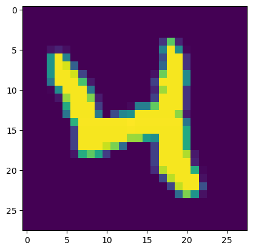
    


    (None, array([4.], dtype=float32))


# Part 1

## One-Versus-All Classifier 

We want to solve the problem

$$
\min_{x} || y - Ax ||
$$

where $A$ is our training data and $x$ is a set of weights for the data.

From the work shown in class, we show that the following must be true for a least squares solution $x$

$$
A^T y = A^T A x
$$

where $B$ is the matrix of basis vectors of the subspace given by $A$.

Then, we can solve for $x$, which must exist.

$$
x = (A^T A)^{-1} A^T y
$$

First, we want to compare class $i$ against all classes $\ne i$. To do this, we create a new $y$ marked either 1 or -1 depending on whether $y_i = i$ or $y_i \ne i$.


```python
# Add column of ones for bias
def create_one_v_all_classifier(trainX, trainY, n):
    A = np.column_stack((trainX, np_ones(trainX.shape[0]))).astype(np.float32)
    y = np.copy(trainY)
    mask1, mask2 = trainY == n, trainY != n
    y[mask1] = 1.0
    y[mask2] = -1.0
    return A, y
```

Now we use the pseudoinverse function, which solves least-squares.


```python
@njit
def solve_one_v_all_classifier(A, y):
    A = A.astype(np.float32)
    y = y.astype(np.float32)
    B = np.linalg.pinv(A) @ y
    return B.astype(np.float32)
```

And let's make some functions that compute and display the confusion matrices of the model. 


```python
@njit
def binary_confusion_matrix(A, y, x):
    m = np.zeros((2,2))
    pred = np.sign(A @ x)
    tp = np.sum((pred == 1) & (y == 1))
    tn = np.sum((pred == -1) & (y == -1))
    fp = np.sum((pred == 1) & (y == -1))
    fn = np.sum((pred == -1) & (y == 1))
    return np.array([
        [tp, tn],
        [fp, fn]
    ])

@njit
def evaluate(X_test, y_test, x, n):
    m = binary_confusion_matrix(X_test, y_test, x)
    display_binary_confusion_matrix(m, n)
    
@njit
def display_binary_confusion_matrix(conf_matrix, n, ax):
    error_rate = conf_matrix[1, :].sum() / conf_matrix.sum()
    # fig, ax2 = plt.subplots(figsize=(8, 8))
    cax = ax.matshow(conf_matrix, cmap='Blues')
    # Add colorbar
    fig.colorbar(cax)
    # Set labels for the x and y axes
    ax.xlabel('Predicted')
    ax.ylabel('True')
    # Add a title with the error rate
    ax.title(f'Confusion Matrix for digit {n}\nError Rate: {error_rate:.2%}')
    # Display the values inside the matrix
    for i in range(conf_matrix.shape[0]):
        for j in range(conf_matrix.shape[1]):
            plt.text(j, i, f'{int(conf_matrix[i, j])}', ha='center', va='center', color='black')
            
    plt.show()
```

Now let's see what the results are for each class $0, \ldots, 9$


```python
m_trains, m_tests = [], []
one_v_all_models = []
for n in tqdm(range(10)):
    A, y = create_one_v_all_classifier(trainX, trainY, n)
    x = solve_one_v_all_classifier(A, y)
    one_v_all_models.append(x) # save for later use
    m_train = binary_confusion_matrix(A, y, x)
    m_trains.append(m_train)
    A_test, y_test = create_one_v_all_classifier(testX, testY, n)
    m_test = binary_confusion_matrix(A_test, y_test, x)
    m_tests.append(m_test)
one_v_all_models = np.array(one_v_all_models).reshape((10, -1))
```


      0%|          | 0/10 [00:00<?, ?it/s]


```python
# source: ChatGPT
# Create a figure with 4 rows and 5 columns of subplots
def create_binary_confusion_matrix_plot(m_trains, m_tests, start=0):
    fig, axs = plt.subplots(5, 4, figsize=(15, 12))

    # Flatten the axs array to make it easier to iterate
    axs_flat = axs.flatten()

    # Iterate through the confusion matrices and plot them
    for i, (m_train, m_test) in enumerate(zip(m_trains, m_tests)):
        # Plot the confusion matrix for training data
        im = axs_flat[2*i].imshow(m_train, cmap='Blues', interpolation='nearest')

        # Add numbers to each square
        for x in range(2):
            for y in range(2):
                axs_flat[i].text(y, x, str(m_train[x, y]), color="black", ha="center", va="center")

        # Add labels, title, and colorbar
        axs_flat[2*i].set_title(f'Train for digit {i} ({100*m_train[1,:].sum()/m_train.sum():.2f}% Error)')
        axs_flat[2*i].set_xticks(np.arange(2))
        axs_flat[2*i].set_yticks(np.arange(2))
        axs_flat[2*i].set_xticklabels(['0', '1'])
        axs_flat[2*i].set_yticklabels(['0', '1'])
        axs_flat[2*i].set_xlabel('Predicted')
        axs_flat[2*i].set_ylabel('True')
        plt.colorbar(im, ax=axs_flat[i], fraction=0.046, pad=0.04)

        # Plot the confusion matrix for testing data
        im = axs_flat[2*i+1].imshow(m_test, cmap='Greens', interpolation='nearest')

        # Add numbers to each square
        for x in range(2):
            for y in range(2):
                axs_flat[i + 10].text(y, x, str(m_test[x, y]), color="black", ha="center", va="center")

        # Add labels, title, and colorbar
        axs_flat[2*i+1].set_title(f'Test for digit {i} ({100*m_test[1,:].sum()/m_test.sum():.2f}% Error)')
        axs_flat[2*i+1].set_xticks(np.arange(2))
        axs_flat[2*i+1].set_yticks(np.arange(2))
        axs_flat[2*i+1].set_xticklabels(['0', '1'])
        axs_flat[2*i+1].set_yticklabels(['0', '1'])
        axs_flat[2*i+1].set_xlabel('Predicted')
        axs_flat[2*i+1].set_ylabel('True')
        plt.colorbar(im, ax=axs_flat[i + 10], fraction=0.046, pad=0.04)

    # Adjust layout for better spacing
    plt.tight_layout()
    plt.show()
    
create_binary_confusion_matrix_plot(m_trains, m_tests)
```


    
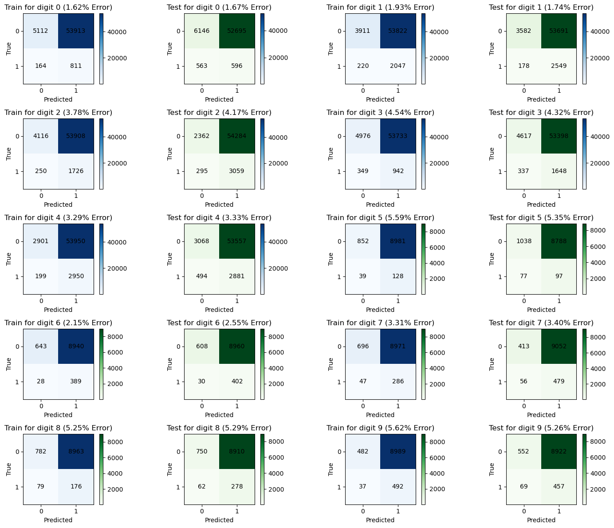
    


From the data, we see that digits 9, 8, 5, and 2 are the hardest to recognize.


Using the one-v-all classifier, we can build a multiclass classifier given by

$$
\hat f(\mathbf x) = \arg \max_{k=0, \ldots 9} g_k(\mathbf x)
$$


```python
@njit
def multiclass_predict(models, x) -> int:
    preds = models @ x
    return int(np.argmax(preds))
```


```python
conf_matrix_ova = np_zeros((10, 10))
testX_ones = np.c_[testX, np.ones(testX.shape[0])].astype(np.float32)
n = 0
for row, actual in zip(testX_ones, testY):
    pred = multiclass_predict(one_v_all_models, row)
    actual = int(actual)
    conf_matrix_ova[actual][pred] += 1
```

    /var/folders/qs/qtpxyfmd5bv20vyzlfl11ncc0000gn/T/ipykernel_3616/274643382.py:3: NumbaPerformanceWarning: '@' is faster on contiguous arrays, called on (Array(float32, 2, 'C', False, aligned=True), Array(float32, 1, 'A', False, aligned=True))
      preds = models @ x


```python
def plot_multiclass_confusion_matrix(confusion_matrix, title=''):
    """
    Plot a multiclass confusion matrix with row and column totals.
    
    Parameters:
    - confusion_matrix: numpy array, the confusion matrix to be plotted
    
    Returns:
    None
    """
    # Calculate row and column totals
    row_totals = np.sum(confusion_matrix, axis=1)
    col_totals = np.sum(confusion_matrix, axis=0)

    # Calculate the error rate
    total_samples = np.sum(confusion_matrix)
    correct_predictions = np.trace(confusion_matrix)
    error_rate = 1 - (correct_predictions / total_samples)

    # Create a figure and axes
    fig, ax = plt.subplots()

    # Plot the confusion matrix using imshow
    cax = ax.imshow(confusion_matrix, cmap='Blues', interpolation='nearest')

    # Add text annotations for each element in the matrix
    for i in range(confusion_matrix.shape[0]):
        for j in range(confusion_matrix.shape[1]):
            ax.text(j, i, int(confusion_matrix[i, j]), va='center', ha='center')

    # Set labels for rows and columns
    ax.set_xticks(np.arange(confusion_matrix.shape[1]))
    ax.set_yticks(np.arange(confusion_matrix.shape[0]))
    ax.set_xticklabels(np.arange(confusion_matrix.shape[1]))
    ax.set_yticklabels(np.arange(confusion_matrix.shape[0]))

    # Set labels and title
    plt.xlabel('Predicted label')
    plt.ylabel('True label')
    plt.title(f'Confusion Matrix {title}\nError Rate: {error_rate:.2%}')

    # Add colorbar
    plt.colorbar(cax)

    # Display the plot
    plt.show()
```


```python
plot_multiclass_confusion_matrix(conf_matrix_ova)
```


    
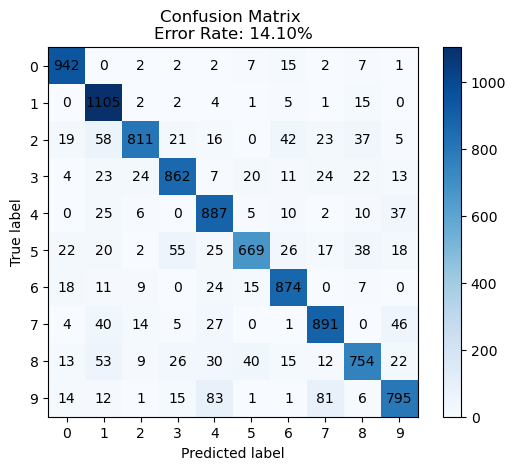
    


## One-vs-One Classifiers

Now let's create a multiclass classifier built out of 1v1 classifiers. These will compare classes $i$ and $j$. 

$$
\hat f(\mathbf x) = \text{sign}(\mathbf{\beta x} + \alpha) = \begin{cases}
1 & \text{ if label = } i \\
-1 & \text{ if label = } j
\end{cases}
$$

To do this, we need to filter out only the data that belongs to classes $i$ and $j$ and train the model on this only.


```python
def create_1v1_classifier(X, y, i, j):
    # Return matrix A such that only digits with labels with i or j are included
    # Return matrix y such that only labels with i or j are included
    mask = (y == i) | (y == j)
    big_mask = np.tile(mask, (1, X.shape[1]))
    A = X[big_mask].reshape((-1, X.shape[1]))
    A = np.column_stack((A, np.ones(A.shape[0]))) # add ones
    # Select only relevant labels
    _y = y[mask]
    # Re-label
    i_mask = _y == i
    j_mask = _y == j
    _y[i_mask] = 1
    _y[j_mask] = -1
    assert _y.shape[0] == A.shape[0] # should have same number of rows

    return A.astype(np.float32), _y.astype(np.float32)
```

The solution and prediction will be exactly the same.


```python
@njit
def solve_1v1_classifier(A, y):
    B = np.dot(np.linalg.pinv(A), y)
    return B.astype(np.float32)

@njit
def predict_1v1(x, dig):
    return np.sign(dig @ x, dtype=np.int8)
```

Now that we can create a classifier for any pair $(i,j)$, we can combine all possible pairs in
the class set. Then, the multiclass model will evaluate all of these and count which has the highest
"vote" count.


```python
import itertools
import functools
# All pairs of numbers under 10
pairs = list(itertools.combinations(range(10), 2))

def create_1v1_confusion_matrix(X, y, i, j, x):
    A, _y = create_1v1_classifier(X, y, i, j)
    return binary_confusion_matrix(A, _y, x)
```


```python
def solve_multiclass_classifier(pairs, trainX, trainY):
    gs = [] # list of (i, j, solution)
    for i, j in tqdm(pairs):
        # Parse data for (i, j)
        A, y = create_1v1_classifier(trainX, trainY, i, j)
        # Solve
        x = solve_1v1_classifier(A, y)
        gs.append((i, j, x))
    return gs

def compute_1v1_confusion_matrices(gs, test_x, test_y):
    # compute confusion matrices for each pair
    return [(i, j, create_1v1_confusion_matrix(test_x, test_y, i, j, x)) for i, j, x in gs]
```


```python
gs = solve_multiclass_classifier(pairs, trainX, trainY)
```


      0%|          | 0/45 [00:00<?, ?it/s]


```python
m_train_1v1 = compute_1v1_confusion_matrices(gs, trainX, trainY)
m_test_1v1 = compute_1v1_confusion_matrices(gs, testX, testY)
```


```python
def grouper(iterable, n, *, incomplete='fill', fillvalue=None):
    "Collect data into non-overlapping fixed-length chunks or blocks"
    # grouper('ABCDEFG', 3, fillvalue='x') --> ABC DEF Gxx
    # grouper('ABCDEFG', 3, incomplete='strict') --> ABC DEF ValueError
    # grouper('ABCDEFG', 3, incomplete='ignore') --> ABC DEF
    args = [iter(iterable)] * n
    if incomplete == 'fill':
        return itertools.zip_longest(*args, fillvalue=fillvalue)
    if incomplete == 'strict':
        return zip(*args, strict=True)
    if incomplete == 'ignore':
        return zip(*args)
    else:
        raise ValueError('Expected fill, strict, or ignore')
        

def create_binary_confusion_matrix_plot(m_trains, m_tests):
    pairs = [(i, j) for i, j, x in m_trains]
    m_trains = [x for _, _, x in m_trains]
    m_tests = [x for _, _, x in m_tests]
    assert len(m_trains) == len(m_tests)
    fig, axs = plt.subplots(5, 4, figsize=(15, 12))

    # Flatten the axs array to make it easier to iterate
    axs_flat = axs.flatten()

    # Iterate through the confusion matrices and plot them
    for i, (m_train, m_test) in enumerate(zip(m_trains, m_tests)):
        j, k = pairs[i]
        # Plot the confusion matrix for training data
        im = axs_flat[2*i].imshow(m_train, cmap='Blues', interpolation='nearest')

        # Add numbers to each square
        for x in range(2):
            for y in range(2):
                axs_flat[i].text(y, x, str(m_train[x, y]), color="black", ha="center", va="center")

        # Add labels, title, and colorbar
        axs_flat[2*i].set_title(f'Train for pair ({j}, {k}) ({100*m_train[1,:].sum()/m_train.sum():.2f}% Error)')
        axs_flat[2*i].set_xticks(np.arange(2))
        axs_flat[2*i].set_yticks(np.arange(2))
        axs_flat[2*i].set_xticklabels(['1', '0'])
        axs_flat[2*i].set_yticklabels(['1', '0'])
        axs_flat[2*i].set_xlabel('Predicted')
        axs_flat[2*i].set_ylabel('True')
        plt.colorbar(im, ax=axs_flat[i], fraction=0.046, pad=0.04)

        # Plot the confusion matrix for testing data
        im = axs_flat[2*i+1].imshow(m_test, cmap='Greens', interpolation='nearest')

        # Add numbers to each square
        for x in range(2):
            for y in range(2):
                axs_flat[i + 10].text(y, x, str(m_test[x, y]), color="black", ha="center", va="center")

        # Add labels, title, and colorbar
        axs_flat[2*i+1].set_title(f'Test for pair ({j}, {k}) ({100*m_test[1,:].sum()/m_test.sum():.2f}% Error)')
        axs_flat[2*i+1].set_xticks(np.arange(2))
        axs_flat[2*i+1].set_yticks(np.arange(2))
        axs_flat[2*i+1].set_xticklabels(['1', '0'])
        axs_flat[2*i+1].set_yticklabels(['1', '0'])
        axs_flat[2*i+1].set_xlabel('Predicted')
        axs_flat[2*i+1].set_ylabel('True')
        plt.colorbar(im, ax=axs_flat[i + 10], fraction=0.046, pad=0.04)

    # Adjust layout for better spacing
    plt.tight_layout()
    plt.show()
        
        
def filter_none(it):
    return [x for x in it if x is not None]

train_batches = grouper(m_train_1v1, 10)
test_batches = grouper(m_test_1v1, 10)

for b1, b2 in zip(train_batches, test_batches):
    create_binary_confusion_matrix_plot(filter_none(b1), filter_none(b2))
```


    
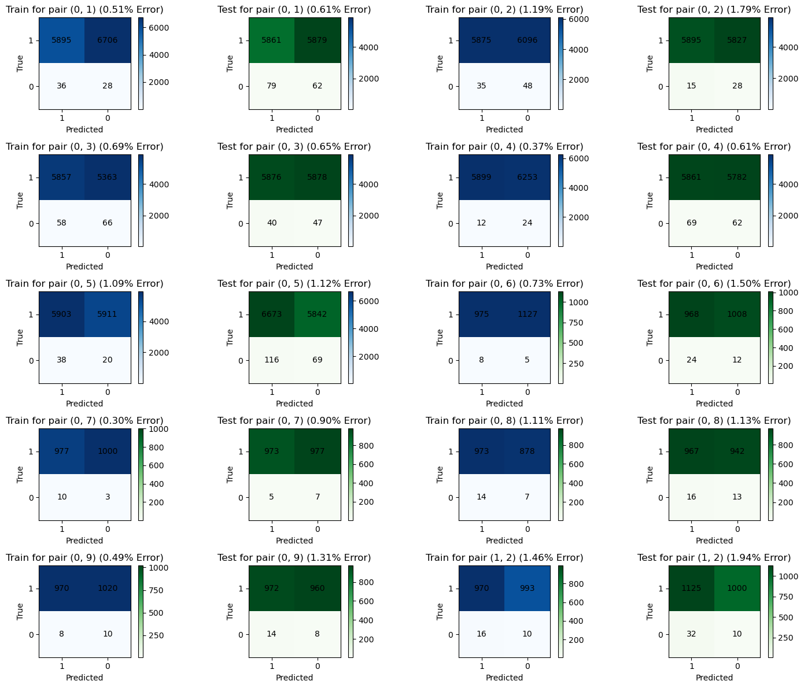
    


    
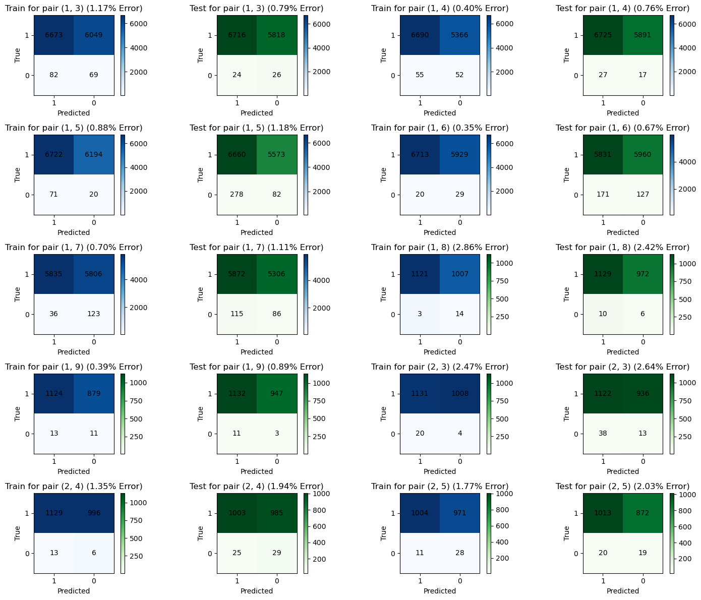
    


    
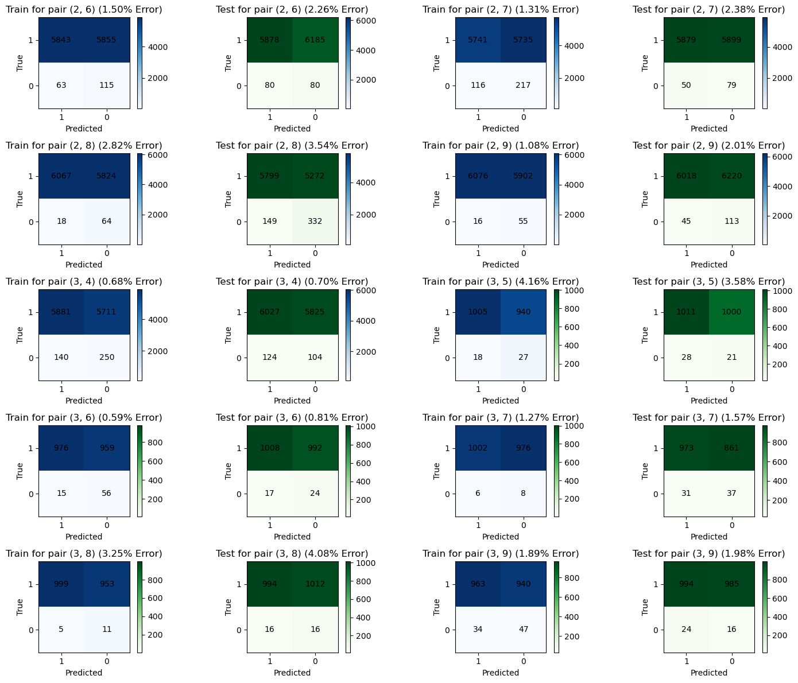
    


    
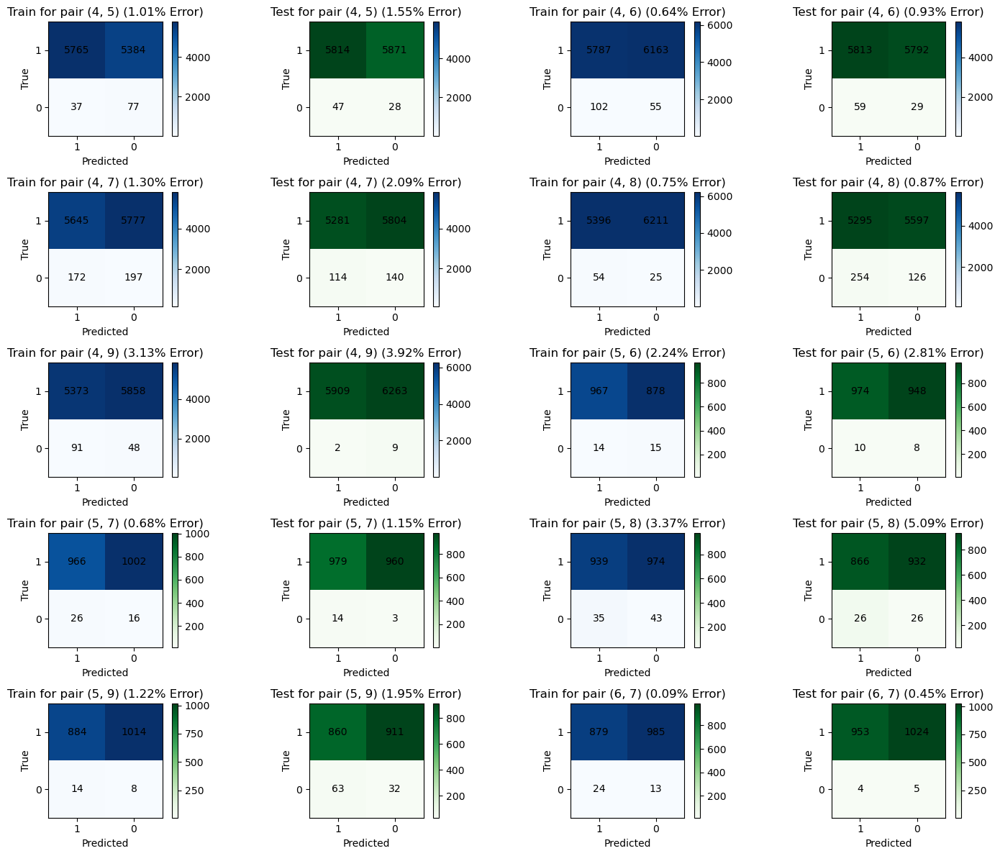
    


    
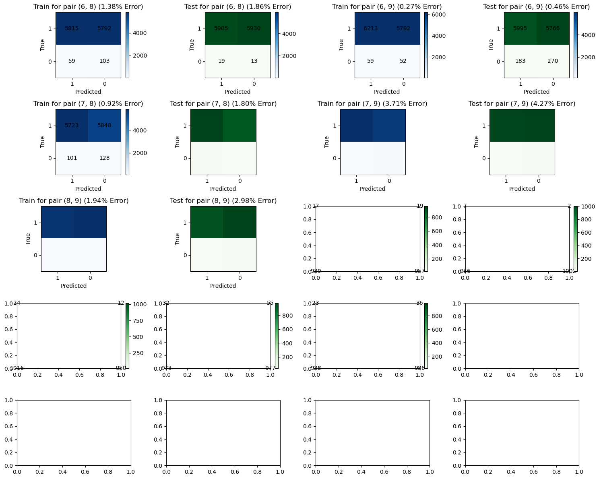
    


```python
def predict_multiclass(gs, dig):
    scores = np.zeros(10)
    for i, j, x in gs:
        dig = dig.astype(np.float32)
        result = np.sign(dig @ x)
        if result == 1:
            scores[i] += 1
        else:
            scores[j] += 1
    return np.argmax(scores)
```


```python
def create_multiclass_confusion_matrix(gs, X, y, progress=False):
    if not progress:
        tqdm = lambda x: x
    matrix = np.zeros((10, 10))
    for feature, actual in zip(tqdm(X), y):
        pred = predict_multiclass(gs, np.append(feature, 1))
        # Set the rows as the predicted value and the column as the actual value
        matrix[int(pred)][int(actual)] += 1
    return matrix
```


```python
mult_m = create_multiclass_confusion_matrix(gs, testX, testY)
```


```python
plot_multiclass_confusion_matrix(mult_m)
```


    
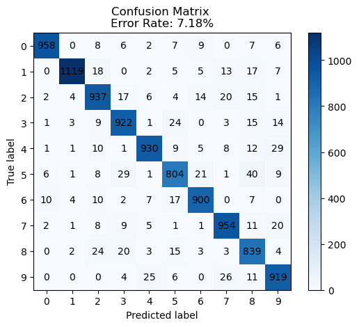
    


## Task 3

The 1v1 classifiers have a much lower error rate than the multiclass classfier, which has an error of 7.1%. They generalize well on the test data, offering a similar error rate as the training data. We can calculate the error for class $k$ by doing 

$$
\frac{\text{number of correctly predicted } k}{\text{total k}}
$$


```python
error = np.zeros(10, dtype=np.float64)
for i in range(10):
    total = np.sum(mult_m[:, i])
    e = (total-mult_m[i][i])/ total
    error[i] = e
```


```python
plt.figure(figsize=(5, 5))
plt.stem(range(len(error)), 100.0*error, linefmt='r-', markerfmt='ro')


# Adding labels and title
plt.xlabel('Digit')
plt.ylabel('Error (%)')
plt.title('Error Plot')
plt.xticks(list(range(len(error))))

# Display the plot
plt.show()
print("Error rates, highest to lowest")
for i, e in sorted(enumerate(error), key=lambda x: x[1], reverse=True):
    print(f"{i}: {100*e:.03f}%")
```


    
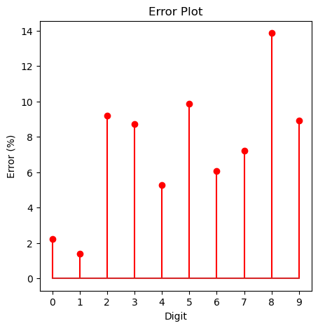
    


    Error rates, highest to lowest
    8: 13.860%
    5: 9.865%
    2: 9.205%
    9: 8.920%
    3: 8.713%
    7: 7.198%
    6: 6.054%
    4: 5.295%
    0: 2.245%
    1: 1.410%


We see that the hardest ones to predict are 8, 5, 2, 9, and 3. The easiest ones are 0 and 1.

## Problem 2

First, let's create a random matrix with normally distributed values.


```python
L = 1000
j = 28*28
```


```python
identity = lambda x: x
sigmoid = lambda x: 1.0 / (1 + np.exp(-x))
sin = np.sin
relu = lambda x: np.maximum(x, 0)
```


```python
funcs = {
    'relu': relu,
    'identity': identity,
    'sigmoid': sigmoid,
    'sin': sin,
}

@njit
def get_feature_params(L, j):
    W = np.random.normal(0, 1, (L, j))
    b = np.random.normal(0, 1, L)
    return W.astype(np.float32), b.astype(np.float32)

@njit
def map_to_feature_space(X, W, b):
    X = X.astype(np.float32)
    Y = X @ W.T + b
    return Y.astype(np.float32)
```


```python
def gen_features(trainX, testX, L):
    W, b = get_feature_params(L, trainX.shape[1])
    train_feat = map_to_feature_space(trainX, W, b)
    test_feat = map_to_feature_space(testX, W, b)
    return train_feat, test_feat

train_feat, test_feat = gen_features(trainX, testX, L)
```


```python
def solve_for_each_func(pairs, train_feat, trainY, funcs):
    d = {}
    for name, f in tqdm(funcs.items(), desc='Solving'):
        train_feat_g = f(train_feat)
        gs = solve_multiclass_classifier(pairs, train_feat_g, trainY)
        d[name] = gs
    return d

def evaluate_multiclass_feature_map(pairs, train_feat, trainY, test_feat, testY, solutions):
    for name, sol in solutions.items():
        train_feat_g = funcs[name](train_feat).astype(np.float32)
        test_feat_g = funcs[name](test_feat).astype(np.float32)
        mult_m = create_multiclass_confusion_matrix(sol, train_feat_g, trainY)
        plot_multiclass_confusion_matrix(mult_m, title=f" train ({name})")
        mult_m = create_multiclass_confusion_matrix(sol, test_feat_g, testY)
        plot_multiclass_confusion_matrix(mult_m, title=f" test ({name})")
```


```python
sols = solve_for_each_func(pairs, train_feat, trainY, funcs)
```


    Solving:   0%|          | 0/4 [00:00<?, ?it/s]


      0%|          | 0/45 [00:00<?, ?it/s]


      0%|          | 0/45 [00:00<?, ?it/s]


      0%|          | 0/45 [00:00<?, ?it/s]


      0%|          | 0/45 [00:00<?, ?it/s]


```python
evaluate_multiclass_feature_map(pairs, train_feat, trainY, test_feat, testY, sols)
```


    
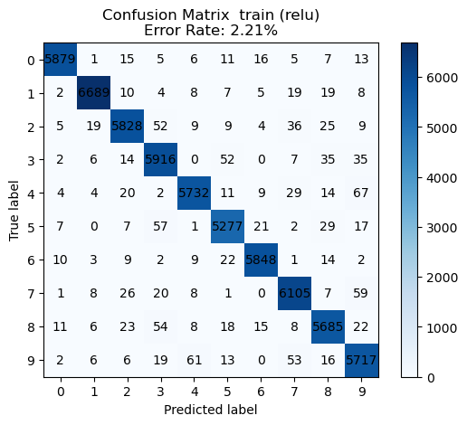
    


    

    


    

    


    
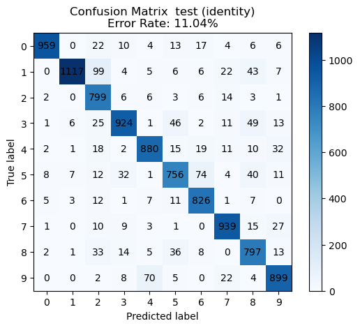
    


    

    


    

    


    
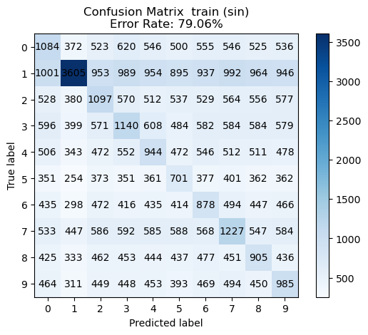
    


    
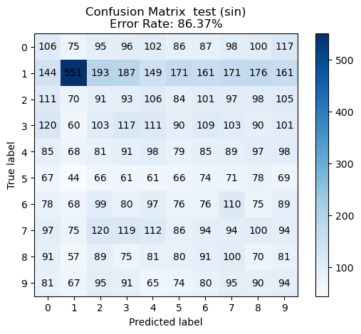
    


We see the best performance with the ReLU non-linearity.

Now let's see which values of $L$ result in the best error. Let's plot $L$ from $1000$, which is slightly below the input data size, all the way to $3000$ in $5$ increments.


```python
def multiclass_error_rate(conf_matrix):
    return 100.0 * (1 - conf_matrix.trace()/conf_matrix.sum())

Ls = np.linspace(1000, 3000, 5)
g = relu
solutions_Ls = []
train_feat_gs = []
test_feat_gs = []
for L in tqdm(Ls):
    L = int(L)
    train_feat, test_feat = gen_features(trainX, testX, L)
    train_feat_g = g(train_feat)
    test_feat_g = g(test_feat)
    train_feat_gs.append(train_feat_g)
    test_feat_gs.append(test_feat_g)
    gs = solve_multiclass_classifier(pairs, train_feat_g, trainY)
    solutions_Ls.append(gs)
```


      0%|          | 0/5 [00:00<?, ?it/s]


      0%|          | 0/45 [00:00<?, ?it/s]


      0%|          | 0/45 [00:00<?, ?it/s]


      0%|          | 0/45 [00:00<?, ?it/s]


      0%|          | 0/45 [00:00<?, ?it/s]


      0%|          | 0/45 [00:00<?, ?it/s]


```python
test_error = []
train_error = []
mult_matrices = []
for gs, train_feat_g, test_feat_g in zip(tqdm(solutions_Ls), train_feat_gs, test_feat_gs):
    mult_m = create_multiclass_confusion_matrix(gs, train_feat_g, trainY)
    train_error.append(multiclass_error_rate(mult_m))
    mult_m = create_multiclass_confusion_matrix(gs, test_feat_g, testY)
    test_error.append(multiclass_error_rate(mult_m))
    mult_matrices.append(mult_m)
```


      0%|          | 0/5 [00:00<?, ?it/s]


```python
# Plotting the data with labels
plt.plot(Ls, train_error, label='Train', marker='o')
plt.plot(Ls, test_error, label='Test', marker='o')

# Adding title and labels
plt.title('Error vs feature space size (ReLU)')
plt.xlabel('Feature Space Size')
plt.ylabel('Error (%)')

# Adding a legend with labels for each line
plt.legend(['Train', 'Test'])
```


    <matplotlib.legend.Legend at 0x14c174cd0>


    
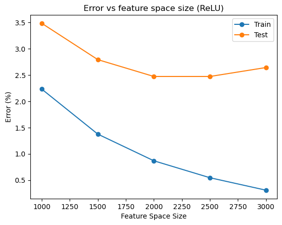
    


We see that the error rate on the training set reliably goes down as $L$ increases. However, we see that this is simply overfitting the training data since the test performance stagnates or even becomes worse.

The optimal $L$ seems to be $\approx 2500$. If we increase $L$ past that, training and inference time increases needlessly.
